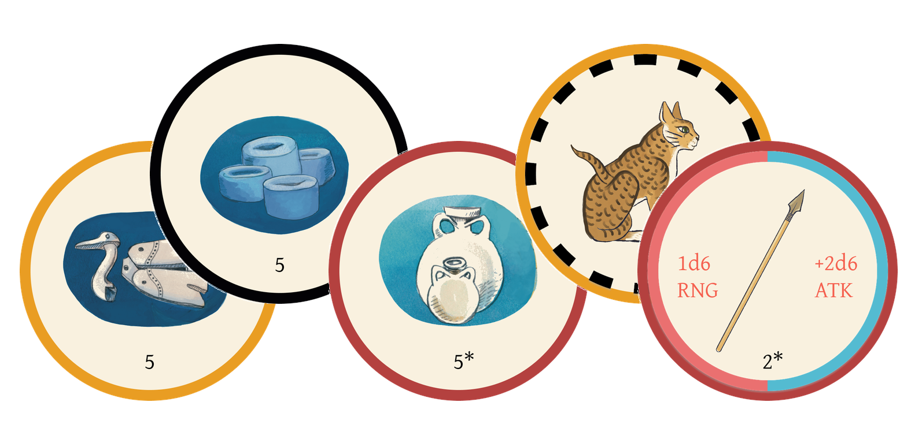
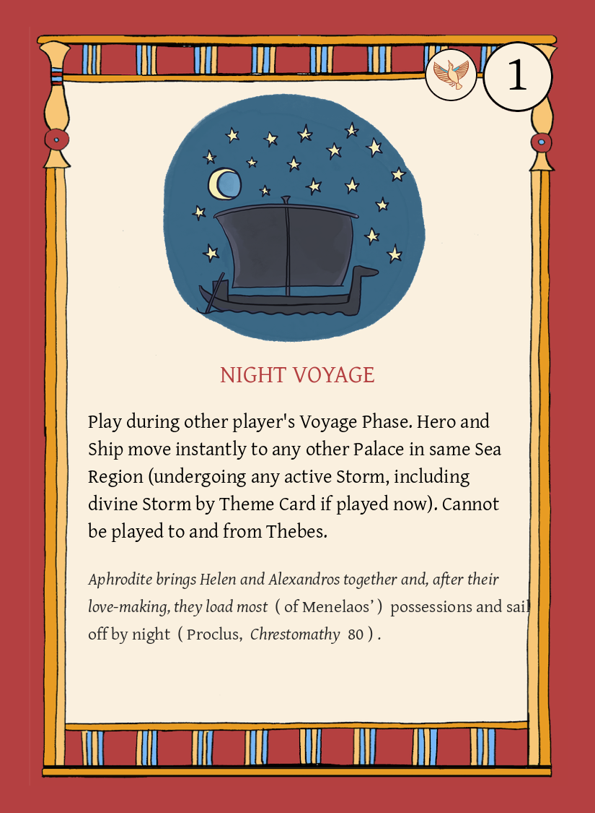

# 🇬🇷 Stormy Seas of Cyprus 🇬🇷
Board game for 2–4 players themed in and around the Odyssey. Players take on the role of a Greek hero, navigating the seas of Cyprus, fighting for treasure and divine favor, while looking for the real Helen of Troy. The board features a unique wind table based movement system that changes throughout the four seasons. 

<!-- some images -->

### Contained
This Repo contains code for compiling all game assets, along with a script for pulling the information from a master [sheet](https://docs.google.com/spreadsheets/d/1wFRQ-EIMEUqx4yjBVeRkrX_5UgcV9rENszB5iZ4jkXM).

⚠️ **Art assets are not included in this repo due to file size restraints** ⚠️

***Credits***
- Artwork for board and cards: Glynnis Fawkes.
- Layout and design: Sylvan and John Franklin.
- Game design: Sylvan and John Franklin.
